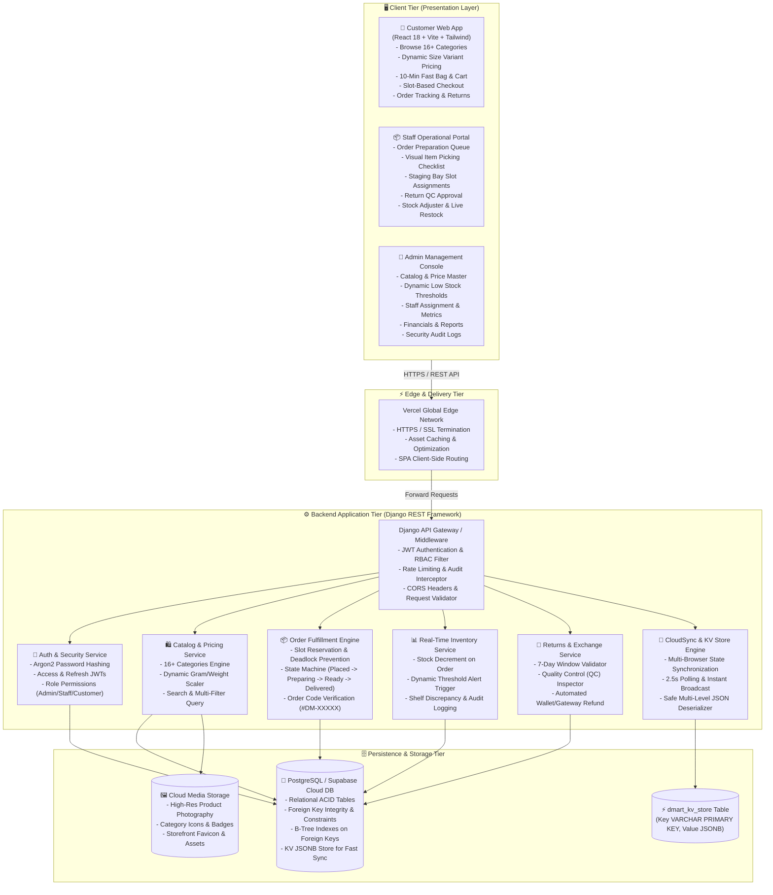
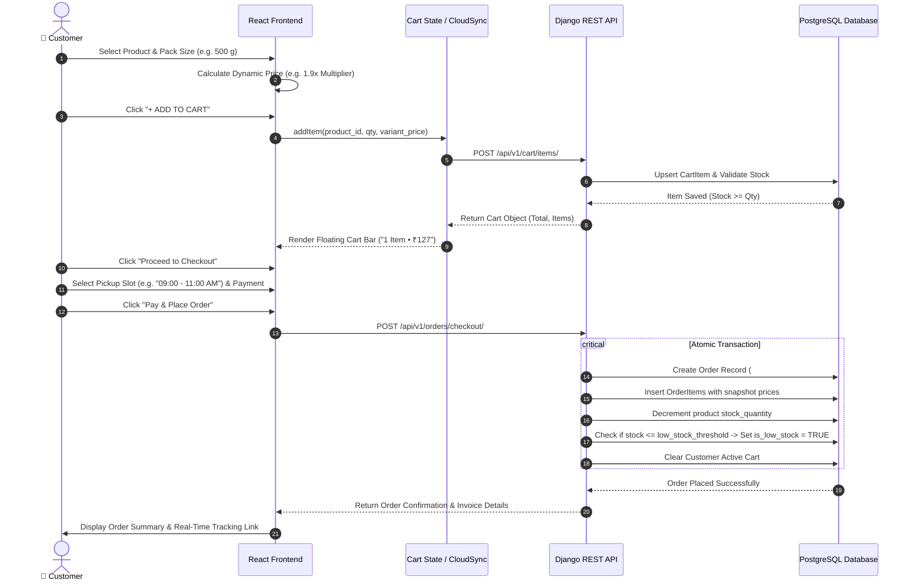
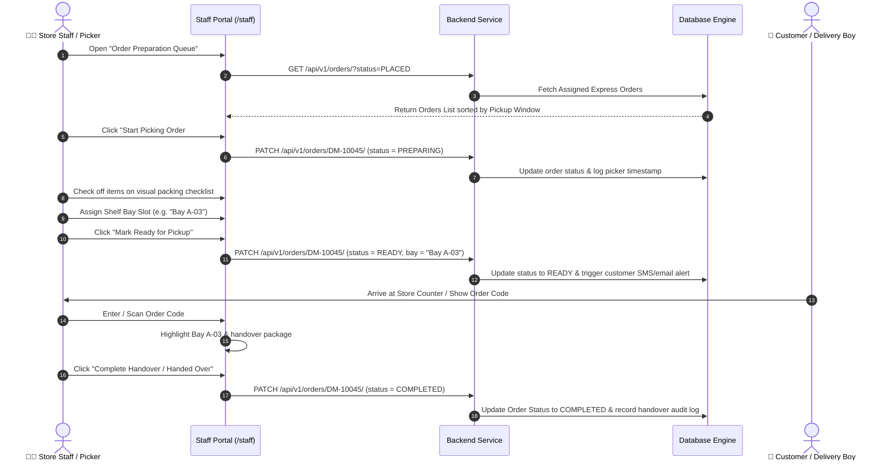
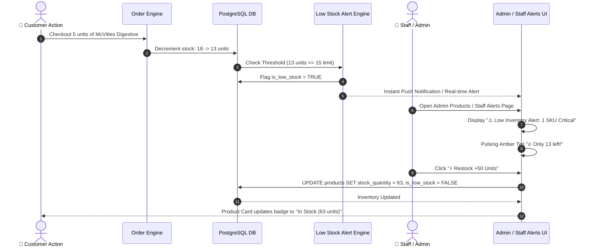
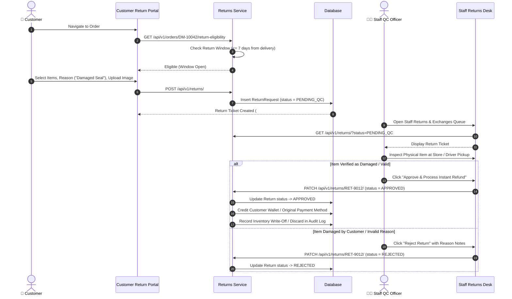

# 🏗️ Mini D-Mart Express — System Architecture, Data Flow & Database Design

This document details the **End-to-End System Architecture**, **Multi-Tier Data Flow Diagrams (DFD)**, **Role-Based Access Control (RBAC) Workflows**, and the **Complete PostgreSQL Entity-Relationship (ER) Database Schema** for the **Mini D-Mart Express** grocery delivery and scheduled express pickup platform.

---

## 1. 🌐 High-Level System Architecture

---

## 2. 🔀 End-to-End Data Flow Diagrams (DFD)

### 2.1 🛒 Customer Order Placement & Checkout Flow

---

### 2.2 📦 Staff Order Preparation & Pickup Queue Flow

---

### 2.3 📊 Low Inventory Alert & 1-Click Fast Restock Flow

---

### 2.4 🔄 Returns & Exchange Processing with QC Approval Flow

---

## 3. 🛡️ Role-Based Access Control (RBAC) Security Matrix

| Feature / Portal Module | 🛒 Customer | 👨‍🍳 Staff / Store Operations | 👑 Admin / Store Manager |
| :--- | :---: | :---: | :---: |
| **Storefront Catalog & Search** | ✅ Read-Only | ✅ Read-Only | ✅ Full Control |
| **Dynamic Variant & Price Selector** | ✅ Allowed | ✅ Allowed | ✅ Allowed |
| **Add to Cart & Express Checkout** | ✅ Allowed | ❌ Restricted | ✅ Allowed (Superuser Authority) |
| **My Orders & Return Initiation** | ✅ Own Orders | ❌ Restricted | ✅ All Orders |
| **Order Preparation & Picking Queue** | ❌ 403 Forbidden | ✅ Full Access | ✅ Full Access |
| **Pickup Bay Staging & Handover** | ❌ 403 Forbidden | ✅ Full Access | ✅ Full Access |
| **Staff Operational Alerts** | ❌ 403 Forbidden | ✅ Read & Restock | ✅ Full Access |
| **Inventory Quick Adjuster** | ❌ 403 Forbidden | ✅ Shelf Count Adjust | ✅ Full Access |
| **Product CRUD & Pricing Master** | ❌ 403 Forbidden | ❌ Restricted | ✅ Create / Edit / Delete |
| **Category & Shelf Management** | ❌ 403 Forbidden | ❌ Restricted | ✅ Full Control |
| **Staff Accounts & Activity Logs** | ❌ 403 Forbidden | ❌ Restricted | ✅ Full Control |
| **Financial Reports & Audit Trails** | ❌ 403 Forbidden | ❌ Restricted | ✅ Full Control |

---

## 4. 🗄️ Database Design (Entity-Relationship Diagram)

```mermaid
erDiagram
    USERS ||--o{ ORDERS : places
    USERS ||--o{ CARTS : owns
    USERS ||--o{ RETURNS : requests
    USERS ||--o{ AUDIT_LOGS : generates
    
    CATEGORIES ||--o{ PRODUCTS : categorizes
    
    PRODUCTS ||--o{ PRODUCT_VARIANTS : has
    PRODUCTS ||--o{ CART_ITEMS : contained_in
    PRODUCTS ||--o{ ORDER_ITEMS : ordered_in
    PRODUCTS ||--o{ INVENTORY_ADJUSTMENTS : adjusted_in
    
    CARTS ||--|{ CART_ITEMS : holds
    
    STORES ||--o{ PICKUP_SLOTS : defines
    STORES ||--o{ ORDERS : fulfills
    
    PICKUP_SLOTS ||--o{ ORDERS : scheduled_in
    
    ORDERS ||--|{ ORDER_ITEMS : contains
    ORDERS ||--o{ ORDER_STATUS_HISTORY : tracks
    ORDERS ||--o{ PAYMENTS : paid_by
    ORDERS ||--o{ RETURNS : originates
    
    RETURNS ||--|{ RETURN_ITEMS : includes
    
    USERS {
        uuid id PK
        varchar email UK
        varchar password_hash
        varchar first_name
        varchar last_name
        varchar phone
        enum role "CUSTOMER, STAFF, ADMIN"
        boolean is_active
        timestamp created_at
        timestamp updated_at
    }

    CATEGORIES {
        varchar id PK
        varchar name
        varchar slug UK
        varchar icon
        text description
        boolean is_active
        integer display_order
    }

    PRODUCTS {
        varchar id PK
        varchar category_id FK
        varchar name
        text description
        decimal price
        decimal discount_price
        varchar weight_size
        varchar unit
        integer stock_quantity
        integer low_stock_threshold
        boolean is_in_stock
        boolean is_low_stock
        varchar image_url
        timestamp created_at
        timestamp updated_at
    }

    PRODUCT_VARIANTS {
        uuid id PK
        varchar product_id FK
        varchar variant_name "250g, 500g, 1kg"
        decimal price_multiplier "1.0, 1.9, 3.6"
        decimal price
        integer stock_quantity
    }

    CARTS {
        uuid id PK
        uuid user_id FK
        decimal subtotal
        integer total_items
        timestamp updated_at
    }

    CART_ITEMS {
        uuid id PK
        uuid cart_id FK
        varchar product_id FK
        varchar selected_variant
        integer quantity
        decimal unit_price
        decimal subtotal
    }

    STORES {
        uuid id PK
        varchar name
        varchar address
        varchar city
        varchar pincode
        varchar contact_phone
        boolean is_active
    }

    PICKUP_SLOTS {
        uuid id PK
        uuid store_id FK
        date slot_date
        time start_time
        time end_time
        integer max_capacity
        integer booked_count
        boolean is_available
    }

    ORDERS {
        varchar id PK
        varchar order_number UK
        uuid customer_id FK
        varchar customer_name
        varchar customer_email
        varchar customer_phone
        uuid store_id FK
        uuid pickup_slot_id FK
        enum fulfillment_type "PICKUP, HOME_DELIVERY"
        text delivery_address
        varchar staging_bay "Bay A-01, Bay B-04"
        decimal subtotal
        decimal discount_amount
        decimal delivery_fee
        decimal tax_amount
        decimal total_amount
        enum status "PLACED, PREPARING, READY, OUT_FOR_DELIVERY, COMPLETED, CANCELLED"
        enum payment_status "PENDING, PAID, FAILED, REFUNDED"
        uuid assigned_staff_id FK
        timestamp placed_at
        timestamp ready_at
        timestamp completed_at
    }

    ORDER_ITEMS {
        uuid id PK
        varchar order_id FK
        varchar product_id FK
        varchar product_name
        varchar selected_variant
        integer quantity
        decimal unit_price
        decimal subtotal
        varchar image_url
    }

    ORDER_STATUS_HISTORY {
        uuid id PK
        varchar order_id FK
        enum status
        uuid changed_by_user_id FK
        text notes
        timestamp created_at
    }

    PAYMENTS {
        uuid id PK
        varchar order_id FK
        varchar transaction_id UK
        enum payment_method "UPI, CARD, NET_BANKING, COD, WALLET"
        decimal amount
        enum status "SUCCESS, PENDING, FAILED"
        timestamp paid_at
    }

    RETURNS {
        varchar id PK
        varchar return_number UK
        varchar order_id FK
        uuid customer_id FK
        enum reason "DAMAGED_ITEM, WRONG_ITEM, EXPIRED, POOR_QUALITY, OTHER"
        enum return_type "REFUND, EXCHANGE"
        enum status "PENDING_QC, APPROVED, REJECTED, COMPLETED"
        decimal refund_amount
        text customer_notes
        text staff_qc_notes
        uuid inspected_by_staff_id FK
        timestamp requested_at
        timestamp resolved_at
    }

    RETURN_ITEMS {
        uuid id PK
        varchar return_id FK
        varchar product_id FK
        integer quantity
        decimal refund_subtotal
    }

    INVENTORY_ADJUSTMENTS {
        uuid id PK
        varchar product_id FK
        uuid staff_id FK
        integer previous_stock
        integer adjusted_stock
        integer delta
        enum reason "RESTOCK, DAMAGE, AUDIT_CORRECTION, THEFT, EXPIRED"
        text notes
        timestamp created_at
    }

    AUDIT_LOGS {
        uuid id PK
        uuid user_id FK
        varchar action "ORDER_CANCEL, STOCK_OVERRIDE, PRICE_CHANGE, ROLE_CHANGE"
        varchar resource_type
        varchar resource_id
        jsonb details
        varchar ip_address
        timestamp created_at
    }

    DMART_KV_STORE {
        varchar key PK
        jsonb value
        timestamp updated_at
    }
```

---

## 5. 📋 Detailed Relational Database Table Specifications

### 5.1 `users` Table
| Column | Type | Constraints | Description |
| :--- | :--- | :--- | :--- |
| `id` | `UUID` | `PRIMARY KEY DEFAULT gen_random_uuid()` | Unique user identifier |
| `email` | `VARCHAR(255)` | `UNIQUE NOT NULL` | Login email address |
| `password_hash` | `VARCHAR(255)` | `NOT NULL` | Argon2 / PBKDF2 secure password hash |
| `first_name` | `VARCHAR(100)` | `NOT NULL` | User's first name |
| `last_name` | `VARCHAR(100)` | `NOT NULL` | User's last name |
| `phone` | `VARCHAR(20)` | `NULL` | Contact phone number |
| `role` | `VARCHAR(20)` | `CHECK (role IN ('CUSTOMER', 'STAFF', 'ADMIN'))` | Role-based authorization level |
| `is_active` | `BOOLEAN` | `DEFAULT TRUE` | Account active toggle |
| `created_at` | `TIMESTAMPTZ` | `DEFAULT CURRENT_TIMESTAMP` | Registration timestamp |
| `updated_at` | `TIMESTAMPTZ` | `DEFAULT CURRENT_TIMESTAMP` | Last profile update |

---

### 5.2 `products` Table
| Column | Type | Constraints | Description |
| :--- | :--- | :--- | :--- |
| `id` | `VARCHAR(100)` | `PRIMARY KEY` | Product unique code (e.g. `prod-mcvities-250g`) |
| `category_id` | `VARCHAR(50)` | `REFERENCES categories(id) ON DELETE RESTRICT` | Category association |
| `name` | `VARCHAR(255)` | `NOT NULL` | Full commercial product name |
| `description` | `TEXT` | `NULL` | Product specifications & nutritional facts |
| `price` | `NUMERIC(10,2)` | `NOT NULL CHECK (price >= 0)` | Discounted / active selling price in INR |
| `discount_price` | `NUMERIC(10,2)` | `NULL CHECK (discount_price >= price)` | MRP / Strikethrough regular price |
| `weight_size` | `VARCHAR(50)` | `DEFAULT '250 g'` | Base weight or pack size unit |
| `stock_quantity` | `INTEGER` | `NOT NULL DEFAULT 0 CHECK (stock_quantity >= 0)` | Real-time shelf inventory count |
| `low_stock_threshold` | `INTEGER` | `NOT NULL DEFAULT 15` | Minimum stock boundary for automated alerts |
| `is_in_stock` | `BOOLEAN` | `DEFAULT TRUE` | Fast stock availability boolean flag |
| `is_low_stock` | `BOOLEAN` | `DEFAULT FALSE` | Dynamic low inventory warning state |
| `image_url` | `TEXT` | `NOT NULL` | High-res product image URL |
| `created_at` | `TIMESTAMPTZ` | `DEFAULT CURRENT_TIMESTAMP` | Catalog insertion date |

---

### 5.3 `orders` Table
| Column | Type | Constraints | Description |
| :--- | :--- | :--- | :--- |
| `id` | `VARCHAR(100)` | `PRIMARY KEY` | Order identifier |
| `order_number` | `VARCHAR(50)` | `UNIQUE NOT NULL` | Human-readable tracking number (e.g. `#DM-10042`) |
| `customer_id` | `UUID` | `REFERENCES users(id) ON DELETE SET NULL` | Ordering customer account |
| `customer_name` | `VARCHAR(200)` | `NOT NULL` | Recipient full name |
| `customer_email` | `VARCHAR(255)` | `NOT NULL` | Customer notification email |
| `customer_phone` | `VARCHAR(30)` | `NOT NULL` | Contact number for pickup OTP & delivery |
| `store_id` | `UUID` | `REFERENCES stores(id)` | Assigned fulfillment store |
| `pickup_slot_id` | `UUID` | `REFERENCES pickup_slots(id)` | Scheduled express pickup time slot |
| `fulfillment_type`| `VARCHAR(20)` | `CHECK (fulfillment_type IN ('PICKUP', 'HOME_DELIVERY'))` | Order dispatch method |
| `delivery_address`| `TEXT` | `NULL` | Complete doorstep address if delivery chosen |
| `staging_bay` | `VARCHAR(50)` | `NULL` | Shelf staging location (e.g. `Bay A-03`) |
| `total_amount` | `NUMERIC(10,2)` | `NOT NULL CHECK (total_amount >= 0)` | Final net payable amount |
| `status` | `VARCHAR(30)` | `DEFAULT 'PLACED'` | `PLACED`, `PREPARING`, `READY`, `COMPLETED`, `CANCELLED` |
| `payment_status` | `VARCHAR(30)` | `DEFAULT 'PAID'` | `PENDING`, `PAID`, `REFUNDED`, `FAILED` |
| `assigned_staff_id`| `UUID` | `REFERENCES users(id) ON DELETE SET NULL` | Operational staff member assigned to pack |
| `placed_at` | `TIMESTAMPTZ` | `DEFAULT CURRENT_TIMESTAMP` | Order creation timestamp |
| `ready_at` | `TIMESTAMPTZ` | `NULL` | When marked ready in staging bay |
| `completed_at` | `TIMESTAMPTZ` | `NULL` | Handover / Delivery completion time |

---

### 5.4 `returns` Table
| Column | Type | Constraints | Description |
| :--- | :--- | :--- | :--- |
| `id` | `VARCHAR(100)` | `PRIMARY KEY` | Return ticket ID (e.g. `ret-dm-10042`) |
| `return_number` | `VARCHAR(50)` | `UNIQUE NOT NULL` | Tracking ticket (e.g. `#RET-8041`) |
| `order_id` | `VARCHAR(100)` | `REFERENCES orders(id) ON DELETE CASCADE` | Associated parent order |
| `customer_id` | `UUID` | `REFERENCES users(id)` | Customer initiating the claim |
| `reason` | `VARCHAR(50)` | `NOT NULL` | `DAMAGED_ITEM`, `WRONG_ITEM`, `EXPIRED`, `QUALITY` |
| `return_type` | `VARCHAR(20)` | `CHECK (return_type IN ('REFUND', 'EXCHANGE'))` | Resolution mode |
| `status` | `VARCHAR(30)` | `DEFAULT 'PENDING_QC'` | `PENDING_QC`, `APPROVED`, `REJECTED`, `COMPLETED` |
| `refund_amount` | `NUMERIC(10,2)` | `NOT NULL` | Net amount to be refunded / exchanged |
| `customer_notes` | `TEXT` | `NULL` | Customer description of the issue |
| `staff_qc_notes` | `TEXT` | `NULL` | Staff Quality Control inspection report |
| `inspected_by` | `UUID` | `REFERENCES users(id) ON DELETE SET NULL` | Staff member conducting QC check |
| `requested_at` | `TIMESTAMPTZ` | `DEFAULT CURRENT_TIMESTAMP` | Submission timestamp |
| `resolved_at` | `TIMESTAMPTZ` | `NULL` | QC approval / payout date |

---

### 5.5 `dmart_kv_store` (Cross-Device Real-Time Sync)
| Column | Type | Constraints | Description |
| :--- | :--- | :--- | :--- |
| `key` | `VARCHAR(100)` | `PRIMARY KEY` | Partition key (e.g. `dmart_shared_orders_v5`) |
| `value` | `JSONB` | `NOT NULL` | Structured JSON document of synchronized entity state |
| `updated_at` | `TIMESTAMPTZ` | `DEFAULT CURRENT_TIMESTAMP` | Last broadcast timestamp for multi-browser sync |

---

## 6. 🚀 Key Performance & Security Optimizations

1. **Database Indexing**:
   - `B-Tree` indexes on `products(category_id)`, `products(price)`, `products(stock_quantity)`.
   - `B-Tree` composite indexes on `orders(customer_id, status)` and `orders(pickup_slot_id)`.
   - `GIN` index on `dmart_kv_store(value)` for fast sub-document searching.

2. **ACID Concurrency Control**:
   - Explicit `SELECT ... FOR UPDATE` locking during checkout prevents double-booking of pickup slots and overselling of stock quantities.

3. **Data Integrity & Cascading Rules**:
   - Strict `CHECK` constraints on monetary columns (`price >= 0`, `stock_quantity >= 0`).
   - Foreign key cascading deletion prevents orphaned order items and return line items.

4. **Multi-Browser Real-Time Sync**:
   - Changes made in one browser (e.g., Staff marking an order `READY` or Admin updating a product price) broadcast to the cloud database and reflect on all customer browsers within 2.5 seconds.
