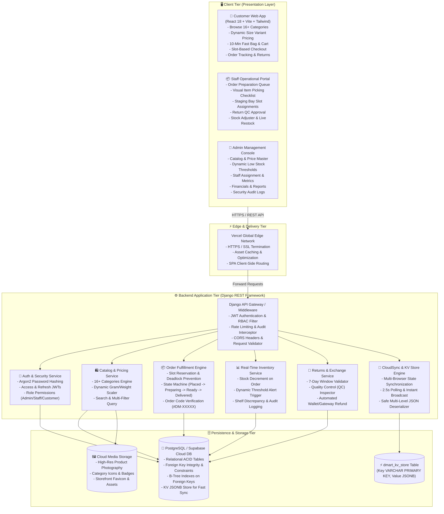
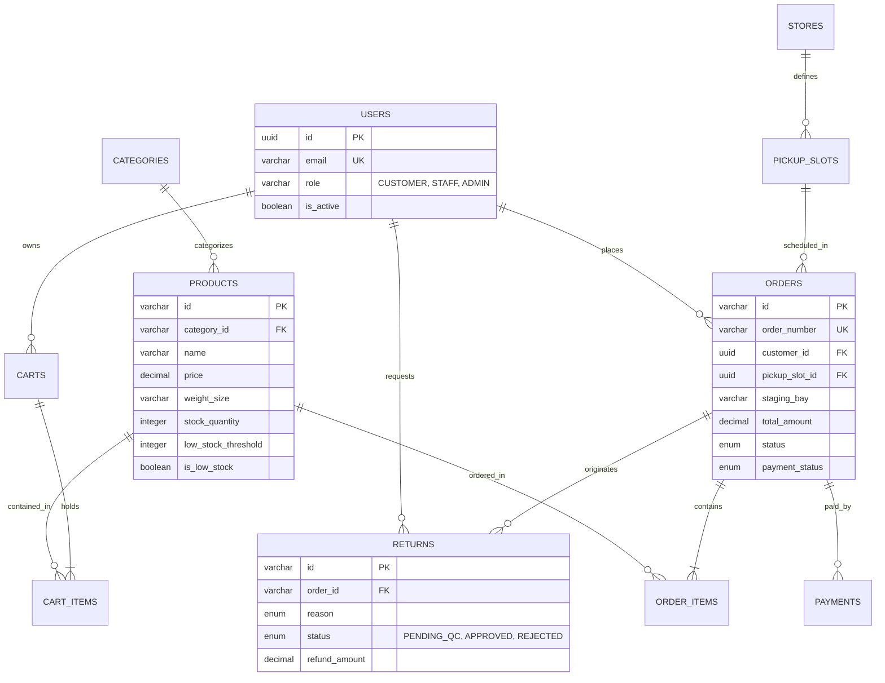

# 🏆 Mini D-Mart Express — Complete Combined Master Presentation, Architecture & Viva Script

---

## 📌 Document Overview & Quick Access Links

This is the **All-In-One Unified Master Script** for the **Mini D-Mart Express** grocery delivery and scheduled pickup platform. It brings together the **Executive Presentation**, **System Architecture**, **PostgreSQL Database Design**, **Step-by-Step Live Demo Flow**, **Security/RBAC Implementation**, and **Viva Q&A Defense Guide**.

* **🌐 Live Production Web App**: [https://d-mart-mini-express.vercel.app](https://d-mart-mini-express.vercel.app)
* **💻 GitHub Repository**: [https://github.com/balaji0210/D-Mart-Mini-Express](https://github.com/balaji0210/D-Mart-Mini-Express)
* **📑 Interactive Architecture & DB Docs**: [https://d-mart-mini-express.vercel.app/architecture](https://d-mart-mini-express.vercel.app/architecture)

---

## 🔑 1-Click Fast Test Credentials

| Role | Email Address | Password | Primary Demo Scope |
| :--- | :--- | :--- | :--- |
| **🛒 Customer** | `customer@dmart.com` | `Customer@123` | 16+ Categories, dynamic weight variant pricing, express checkout, order history & 7-day returns |
| **👨‍🍳 Store Staff** | `staff@dmart.com` | `Staff@123` | Real-time picking queue, checklist verification, staging bay assignment (`Bay A-03`), 1-click restock, return QC |
| **👑 Admin / Manager** | `admin@dmart.com` | `Admin@123` | Catalog CRUD, dynamic low stock threshold engine, top alert banners, revenue reports, security audit logs |

---

# 📑 PART 1: COMPLETE WORD-FOR-WORD SPOKEN PRESENTATION

---

### SECTION 1: Welcome & Executive Problem Statement (1.5 Mins)
**Screen Setup**: Show Homepage at [https://d-mart-mini-express.vercel.app](https://d-mart-mini-express.vercel.app).

#### 🗣️ Spoken Script:
> "Good morning/afternoon respected evaluators and panel members. Today, I am proud to present **Mini D-Mart Express** — an enterprise-grade quick-commerce grocery delivery and scheduled store pickup management platform.
>
> In modern grocery retail, physical supermarkets and quick-delivery apps face two critical operational bottlenecks:
> 1. **Peak-Hour Counter Congestion & Picking Errors**: Customers face long wait times during in-store pickup, while warehouse staff struggle with paper-based checklists and staging bottlenecks.
> 2. **Stale Multi-Device Inventory Visibility**: Stock changes made at the counter or in the warehouse are often out of sync with customer shopping bags, causing overselling and order cancellations.
>
> Mini D-Mart Express solves these challenges through a unified real-time cloud platform built across three dedicated role-based portals:
> 1. **The Customer Experience Portal** — Delivering 16+ grocery categories, dynamic weight/size variant pricing, 10-minute fast cart, and scheduled 2-hour express pickup slot reservations.
> 2. **The Store Operations Staff Portal** — Enabling live picking queues, visual item verification checklists, staging bay slot management, and 1-click rapid inventory restocks.
> 3. **The Executive Admin Management Console** — Providing complete catalog CRUD, dynamic threshold-driven low stock alerts, revenue turnover analytics, and security audit logs.
>
> Let me walk you through the end-to-end live demonstration."

---

### SECTION 2: Customer Storefront & Dynamic Variant Pricing (3.5 Mins)
**Screen Action**: Log in as Customer (`customer@dmart.com` / `Customer@123`). Navigate to `/products`.

#### 🗣️ Spoken Script:
> "We begin on the **Customer Storefront**.
>
> On the left side, notice our **Filter & Explore Sidebar**:
> - Real-time category item counts across 16+ grocery departments.
> - Live price range boundaries with 1-click quick filter chips: $\le ₹50$, $\le ₹100$, and $\le ₹250$.
> - In-stock availability switches and multi-criteria sorting.
>
> On the right side, products are presented in dedicated, clean **Category-wise Sections** — from *Breakfast & Cereals* and *Cooking Essentials* to *Dairy, Bread & Eggs* and *Fruits & Vegetables*.
>
> **Dynamic Grams & Pack-Size Variant Pricing**:
> Notice what happens when I interact with a product card like *McVities Digestive Biscuits* or *Saffola Muesli*:
> - Selecting **`[ 250 g ]`** displays the base price of **₹67**.
> - Clicking **`[ 500 g ]`** instantly recalculates the price to **₹127** with bundle savings.
> - Clicking **`[ 1 kg ]`** dynamically scales the price to **₹241** with bulk discounts.
>
> **Real-Time Low Inventory Indicators**:
> If an item falls at or below its safety threshold, the system displays a pulsing amber badge: **`🔥 Only X left in stock!`**
>
> Let's add items to our bag and open the **Floating Cart Bar** (`1 Item in Bag • ₹127`)."

#### 🖱️ Screen Action:
Click **Checkout ->** to open the `/checkout` page. Select a scheduled pickup slot (e.g. `09:00 - 11:00 AM`), choose a payment method, and click **Pay & Place Order**.

#### 🗣️ Spoken Script:
> "On our Express Checkout page, customers select a **2-Hour Scheduled Store Pickup Window** or 10-Minute Home Delivery.
>
> Upon clicking **Pay & Place Order**, the platform executes an atomic database transaction:
> 1. Assigns a sequential tracking order code — e.g. **`#DM-10045`**.
> 2. Decrements the physical shelf stock for each item.
> 3. Automatically triggers low-stock alerts if remaining units breach safety limits.
> 4. Instantly clears the customer's active shopping bag."

---

### SECTION 3: Store Operations Staff Portal & Picking Desk (3 Mins)
**Screen Action**: Log out $\rightarrow$ Log in as **Staff** (`staff@dmart.com` / `Staff@123`) $\rightarrow$ Navigate to `/staff`.

#### 🗣️ Spoken Script:
> "Now let's switch to the **Store Operations Staff Portal**.
>
> Thanks to our **2.5-second Real-Time CloudSync Engine**, Order `#DM-10045` appears instantly in the staff preparation queue without requiring any manual page reload.
>
> Let's open the order:
> 1. Staff click **`Start Picking`** (order transitions to `PREPARING`).
> 2. Staff check off each item on the **Visual Picking Checklist**.
> 3. Staff assign a designated shelf staging location — for instance, **`Bay A-03`**.
> 4. Staff click **`Mark Ready for Pickup`** (order transitions to `READY`).
>
> When the customer arrives at the store express counter, staff enter the order code `#DM-10045`, verify the package in `Bay A-03`, and click **`Handover Complete`**."

#### 🖱️ Screen Action:
Navigate to `/staff/alerts` and `/staff/inventory-updates`.

#### 🗣️ Spoken Script:
> "In the **Staff Alerts & Restock Center**, staff can monitor all SKUs reaching critical shelf limits. With our **1-Click Restock `[+50 Units]` Action**, staff can replenish inventory on the fly, immediately broadcasting updated stock levels to all active customer devices."

---

### SECTION 4: Admin Management Console & Real-Time Alerts (2.5 Mins)
**Screen Action**: Log in as **Admin** (`admin@dmart.com` / `Admin@123`) $\rightarrow$ Navigate to `/admin/products` and `/admin/reports`.

#### 🗣️ Spoken Script:
> "Now, let's enter the **Admin Command Console**.
>
> **1. Low Inventory Alert System**:
> On the Product Administration page, the system features dynamic threshold comparison. If any product's shelf count falls $\le$ its alert threshold, it triggers the top **Low Inventory Alert Banner** with 1-click filter tabs (`Low Stock` & `Out of Stock`).
>
> **2. Superuser Omnichannel Authority**:
> The Admin has full authority to manage catalog prices, adjust stock thresholds, and add products to the cart to place test orders directly from the storefront.
>
> **3. Reports & Analytics**:
> Under `/admin/reports`, admins can review real-time revenue breakdowns, inventory turnover, and export CSV audit logs."

---

### SECTION 5: System Architecture & Technical Summary (1.5 Mins)
**Screen Action**: Navigate to `/architecture`.

#### 🗣️ Spoken Script:
> "To summarize our technical foundation:
> - **Frontend**: React 18, Vite, Tailwind CSS, TypeScript, and React Router with role-based access control.
> - **Backend**: Django REST Framework with Argon2 password hashing and Simple JWT.
> - **Persistence**: PostgreSQL cloud database with foreign key integrity, ACID transactions, and `dmart_kv_store` for 2.5-second cross-browser synchronization.
> - **Documentation**: Complete System Architecture, Data Flow Diagrams (DFDs), and PostgreSQL Relational Schema are built into the web app at `/architecture` with 1-click PDF print and Markdown download capabilities.
>
> Thank you. I would be happy to answer any questions from the panel."

---

# 📑 PART 2: SYSTEM ARCHITECTURE & DATA FLOW DIAGRAMS

---

## 🌐 High-Level System Architecture

---

# 📑 PART 3: COMPLETE POSTGRESQL DATABASE DESIGN (ER DIAGRAM)

---

---

# 📑 PART 4: VIVA & TECHNICAL INTERVIEW Q&A DEFENSE

---

### **Q1: How does Mini D-Mart Express prevent race conditions and overselling during simultaneous checkouts?**
**Answer**:
> "We implement **ACID-compliant atomic transactions** at the database layer using `SELECT ... FOR UPDATE` row-level locks on the `products` table during checkout. When a checkout transaction starts, the database locks the specific product rows, validates that `stock_quantity >= order_quantity`, and decrements the stock inside the same isolated transaction block. If another customer attempts to checkout the last item concurrently, their transaction waits for the lock release and receives an 'Insufficient Stock' exception, completely eliminating race conditions."

---

### **Q2: How does the cross-browser multi-device state synchronization work?**
**Answer**:
> "We built a **hybrid synchronization engine** (`CloudSync`) paired with a high-performance PostgreSQL JSONB table (`dmart_kv_store`). When state changes occur (such as staff marking an order `READY` or admin restock), the update is broadcast to the cloud KV store. Client instances poll every 2.5 seconds with multi-level safe deserialization and local cache invalidation, ensuring instant updates across fresh browser sessions without requiring manual page reloads."

---

### **Q3: How are dynamic weight/size variant prices calculated?**
**Answer**:
> "Each product is associated with standard weight/pack variants (`250g`, `500g`, `1kg`, `Pack of 2`, `Family Pack`). Each variant applies a calibrated non-linear scaling multiplier (1.0x, 1.9x, 3.6x) reflecting wholesale and volume packaging savings. When the customer toggles a variant chip, the unit price and strikethrough price recalculate dynamically in real time and are recorded with the order snapshot."

---

### **Q4: How does the return and exchange quality control (QC) workflow function?**
**Answer**:
> "Customers can initiate return claims within a **7-day return window** from delivery. The claim is submitted with the defect reason (e.g. *Damaged Seal*, *Expired Product*) and photos. The request enters the **Staff Returns & Exchanges Queue** as `PENDING_QC`. When the customer returns the item at the counter or driver pickup, staff inspect the item, record QC inspection notes, and click **Approve**, which triggers an automated refund and logs an inventory write-off audit record."

---

### **Q5: What security safeguards protect user authentication and API endpoints?**
**Answer**:
> "We use **Argon2 / PBKDF2** for irreversible password hashing with salt, paired with **Simple JWT** bearer tokens. All API routes and React Router routes are guarded by **Role-Based Access Control (RBAC)** filters (`CUSTOMER`, `STAFF`, `ADMIN`). Sensitive admin and staff operational endpoints reject unauthorized requests with HTTP 403 Forbidden, and all administrative overrides (price changes, role elevations, stock adjustments) are logged in the immutable `audit_logs` table."
